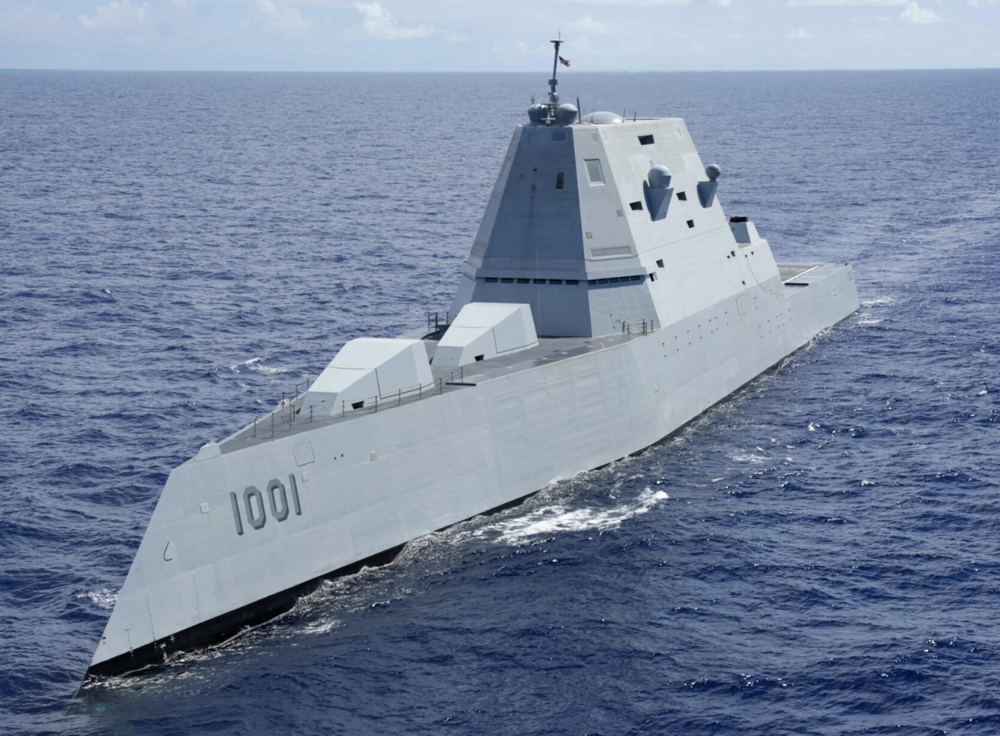

# LLMs From Scratch

  

Repository of architectures for Large Language Models (LLMs), along with algorithms for
data collection, pretraining, finetuning, evaluation and distillation.

All algorithms are implemented from scratch in PyTorch. Hence it serves as an excellent reference
for students, ML engineers and ML practitioners alike. This repository is inspired by the
[minGPT series](https://github.com/karpathy/minGPT), and adds on top by following industry best practices
like clean and well documented code, modular and well tested components, following standard PyTorch APIs
like Datasets and DataLoaders. The repository also aims to expand beyond pretraining, and include other algorithms too
like LoRA finetuning, distillation and RLHF alignment.

## Algorithms implemented in this repository
1. [Pretraining of GPT models](https://arxiv.org/abs/2005.14165).
2. [Finetuning of GPT models using LoRA](https://arxiv.org/abs/2106.09685).

## Getting started with small prototypes

### Setting up the dev environment.
#### On Mac
Note that only small models with around 500k parameters can be trained on Mac due to limited memory and lack of GPUs. This is still a good step to do for prototyping architecture implementations on small datasets.

We will be using conda virtual environments for development. If you have not used conda before, install it first following instructions [here](https://developer.apple.com/metal/pytorch/). Now create a conda environment and activate it. Sample commands to run in the terminal are
`conda create --name llms_from_scratch_env python=3.9`

`conda activate llms_from_scratch_env`

Now install requirements by running `pip install -r requirements.txt`

#### On AWS
Create an [AWS account](https://aws.amazon.com/). Go to the EC2 page and click `Launch Instance`. Give a name for your instance, and select a recent PyTorch image as the AMI. Request a `t2.large` instance with 8GB RAM to try out the small example first. To scale to larger examples, you will need to request more powerful machines with GPUs. But it is a good idea to first get a small example working on a small machine to prototype. Click `Launch Instance` button to create the instance. Now click the instance, Connect -> SSH client, and copy the ssh command shown. Running this command from your mac will ssh into the EC2 instance. Once you ssh into the EC2 instance, clone this repository using `git clone git@github.com:hydra-ai-models/llms_from_scratch.git`. Now move to the main repository directory using `cd llms_from_scratch`.

Run the commands `conda create --name llms_from_scratch_env python=3.9`, `conda activate llms_from_scratch_env` and `pip install -r requirements.txt` as explained in the previous section to set up the dev environment.

### Running the trainer scripts
#### Without HuggingFace Accelerate
To pretrain GPT model, run the python script `trainer_gpt_pretraining.py` using `python -m trainer_gpt_pretraining`, or run the Jupyter notebook `trainer_gpt_pretraining.ipynb`. Running this script will train the GPT model, and store the model file in the `output` directory. Similarly, a text file is created in this directory with more details about the trainable and non trainable parameters in the model.

To perform LoRA finetuning of the GPT model, run the python script `trainer_lora_finetuning.py` using `python -m trainer_lora_finetuning`, or run the Jupyter notebook `trainer_lora_finetuning.ipynb`. Running this script will finetuning the GPT model, and store the model file in the `output` directory. Similarly, a text file is created in this directory with more details about the trainable and non trainable parameters in the model.

#### With HuggingFace Accelerate
Hugging Face accelerate library allows you to scale training seamlessly in a distributed setting using optimizations from NVIDIA Megatron or DeepSpeed.
To use HuggingFace accelerate for training, first create a config file for training by running `accelerate config`. On Mac, set `No distributed training`, and answer No to `dynamo script optimization` and `mixed precision` training. Now run the training using `accelerate launch -m trainer.trainer_gpt_pretraining_with_accelerate`

## Disclaimer

THE SOFTWARE IS PROVIDED “AS IS”, WITHOUT WARRANTY OF ANY KIND, EXPRESS OR IMPLIED, INCLUDING BUT NOT LIMITED TO THE WARRANTIES OF MERCHANTABILITY, FITNESS FOR A PARTICULAR PURPOSE AND NONINFRINGEMENT. IN NO EVENT SHALL THE AUTHORS OR COPYRIGHT HOLDERS BE LIABLE FOR ANY CLAIM, DAMAGES OR OTHER LIABILITY, WHETHER IN AN ACTION OF CONTRACT, TORT OR OTHERWISE, ARISING FROM, OUT OF OR IN CONNECTION WITH THE SOFTWARE OR THE USE OR OTHER DEALINGS IN THE SOFTWARE.

The views and opinions of authors expressed herein do not necessarily state or reflect those of their employers or any agency thereof.
